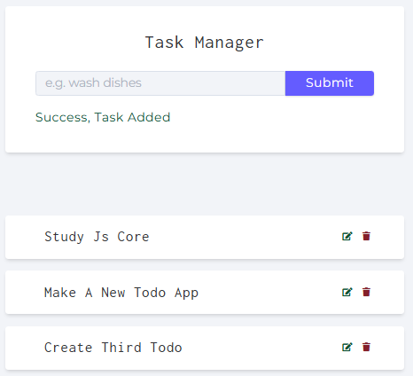

# Vanilla JS Todo App with MongoDB

This project is a simple **Todo App** built with **Vanilla JavaScript**, **HTML**, **CSS**, and **MongoDB**. The app allows you to create, edit, and delete todos, and stores them in a MongoDB database using **Mongoose**. The app provides a clean, intuitive interface, and the data is dynamically updated via API calls.

### Todo List View


### Add/Edit Todo Form



## Features

- **Add Todos**: You can add new tasks to your todo list.
- **Edit Todos**: You can modify the text of any existing todo.
- **Delete Todos**: You can delete a todo from the list.
- **Persistence**: Todos are saved to a MongoDB database, so they persist across page refreshes.

## Technologies Used

- **HTML**: For the structure and layout of the page.
- **CSS**: For styling the app.
- **JavaScript**: For the logic and functionality of the app, including DOM manipulation and API requests.
- **MongoDB**: For storing todos.
- **Mongoose**: To interact with MongoDB in a structured way.
- **Node.js/Express**: Backend server to handle API requests.

## How to Set Up and Run

### Prerequisites

Before you begin, ensure you have the following installed:

- **Node.js** (with npm)
- **MongoDB** (either local or using a cloud service like MongoDB Atlas)

### Installation

1. Clone the repository:
   ```bash
   git clone https://github.com/yourusername/todo-app.git
   cd todo-app

2. Install the necessary dependencies:
   ```bash
   npm install
   
3. Set up your MongoDB connection:

   - Create a .env file in the root directory.
   - Add your MongoDB URI:
      ```bash
      MONGO_URI=your_mongo_connection_string

5. Run server:

   ```bash
   http://localhost:3000

